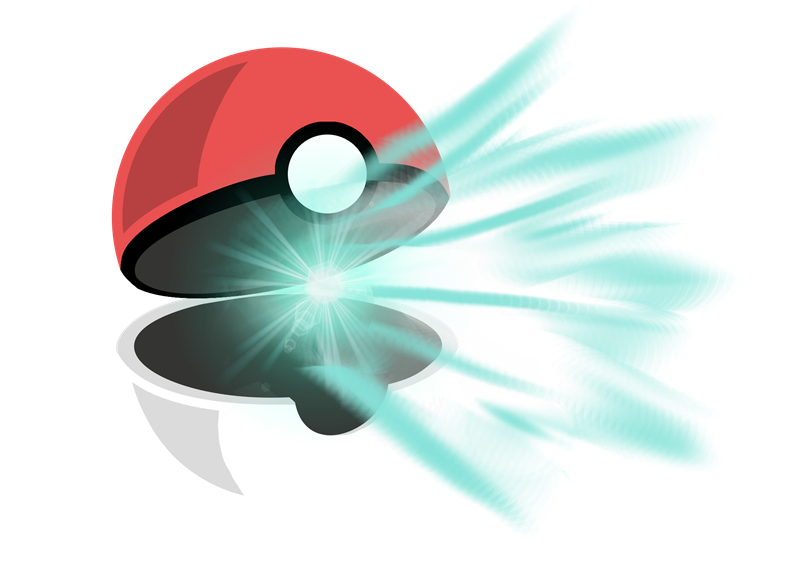

# Procesverslag
Markdown is een simpele manier om HTML te schrijven.  
Markdown cheat cheet: [Hulp bij het schrijven van Markdown](https://github.com/adam-p/markdown-here/wiki/Markdown-Cheatsheet).

Nb. De standaardstructuur en de spartaanse opmaak van de README.md zijn helemaal prima. Het gaat om de inhoud van je procesverslag. Besteedt de tijd voor pracht en praal aan je website.

Nb. Door *open* toe te voegen aan een *details* element kun je deze standaard open zetten. Fijn om dat steeds voor de relevante stuk(ken) te doen.

## Jij

### Ontwerper:
Ruby Spee

#### Je startniveau:
Blauw met een tintje rood

# Je plan

  
De eerste versie/schets van je ontwerp & je persoonlijke uitdaging

  ### Mijn inspiratie:
  
  
  Ik had eigenlijk helemaal geen schets. Ik had een hele, HELE slechte mini schets gemaakt tijdens de les, maar die kan ik helaas niet meer vinden. Ik had ook eigenlijk vrij snel mijn idee al veranderd. Meteen na het eerste feedback gesprek, in de tweede les, ben ik meteen iets anders gaan doen. Mijn eerste idee was om boven aan het scherm een plank te maken en daarop alle pokeballen en dat je dan horizontaal kon scrollen en dan erop klikt en dat Pikachu dan verschijnt midden in je scherm. Mijn idee is niet zo erg veranderd, want ik was nog steeds gebleven bij het idee met de pokeballen en dat je door middel van daarop klikken Pikachu ziet. Ik had vorig jaar bij fronted ook iets gemaakt wat met Pokemon te maken had, dus moest daar aan denken en toen kwam ik op het idee om weer een pokedex te maken, dat is toch echt een karakteristieks aan Pokemon. Daardoor kwam ik met het idee om een soort Pokecenter te maken, net als in de game. 

  

  ### Je ambitie: 
  Aan deze technieken/punten wil ik werken:
  - Ik heb nu al vaker code geschreven, dus wil wat meer uitdagende dingen maken. Wat meer javascript
  - Meer dingen laten bewegen, dus met animatie tools en ook javascript
 

## Voortgang/Feedback 1

  
Mijn bevindingen + wijzigingen

  ### Feedback:
  De feedback die ik van Xavier heb gekregen:
  - Aangezien je de pokemon in het midden ziet met allemaal pokeballen eromheen past het volledig bij dit onderwerp en niet bij iets anders
  - Een uniek kenmerk zijn de pokeballen
  - Misschien leuk dat als  je op de pokemon klikt dat hij dan gaat springen of dat hij een bliksemschicht achter laat
  - Misschien is het leuk om de pokemonball vast te kunnen pakken en naar de pokemon te kunnen gooien
  - Progressive disclosure is toegepast aangezien je eerst een overzicht ziet en later pas de details

  ### Wijzegingen:
  Dit is nog echt mijn eerste schets, dus ik moet alles nog veel beter uitwerken. Voor nu zit alles nog in mijn hoofd alleen, dus moet even of betere schetsen maken of beginnen met code zodat ik goed mijn idee kan overbrengen. 

## Voortgang/Feedback 2

  
Mijn bevindingen + wijzigingen

  
  Het tweede feedback gesprek heb ik met Maxime gedaan. We waren beide nog heel erg bezig met nog dingen toevoegen, dus we hebben gekeken naar wat we tot nu toe hadden en ook onze ideeën besprokken die we nog hadden. We hebben ook elkaar geholpen met nog wat dingen verzinnen, dus was een goed gesprek. 
  Ik moet nog de paaseieren toevoegen. Dat lukte nog niet, dus dat ga ik deze les vragen aan Sanne. Ik wil graag dat er een pokemon van rechts naar links gaat, onderin het beeld, maar de image wilt niet mee werken. Ik kreeg als feedback dat ik geluid kan gebruiken voor de buttons. Dat wilde ik al gaan doen, dus fijn dat iemand anders ook dat idee heeft. Tijdens de les kregen we een voorbeeld met een pop-up die je krijgt als je de pagina opent en dat er dan een geluidje komt als je erop klikt. Dat wilde ik gaan doen en dat je dan of Pikachu hoort of de titel song van Pokemon. Wat ook een goed punt was, was dat ik soms af en toe nog px gebruik en dat ik beter em of procenten kan gebruiken, dus dat ga ik nog even omrekenen en er em van maken. 

## Voortgang/Feedback 3

  
Mijn bevindingen + wijzigingen

  Bij het laatste feedback moment, met Dilay, kreeg ik niet echt veel feedback over dingen die ik kon veranderen nog. Ze vond dat het er goed uitzag en ze had niks meer erop aan te merken. Ze had wel een opmerking over progressive disclosure, over dat ik nog niet echt informatie over pikachu liet zien en alleen het plaatje. Daar had ik zelf ook al over nagedacht, alleen ik kwam pas met dat idee, toen ik zo goed als klaar was, dus ik zou dan alles moeten herschrijven om een pop-up met informatie toe te voegen. Ik wilde dat dus wel doen, maar ben er niet aan toe gekomen. Het was daardoor wel leerzamer, want nu heb je alleen een plaatje van Pikachu. Wat ik ook wel grappig vond is dat ze heel erg afgeleid raakte van de andere Pokemons die af en toe op het scherm verschijnen. Ik snap wel wat ze bedoeld, maar ik vond het er goed bij passen en dan gebeurd er ook wat meer op het scherm in plaats van alleen maar klikken op de buttons en dan zie je Pikachu. Dat was eigenlijk alle feedback die ik kreeg, verder was alles goed als je keek naar het beoordelingsformulier. 

## Reflectie

  
Mijn eindresultaat & persoonlijke ontwikkeling

  ### Je uitkomst - karakteristiek screenshot(s):
  

  ### Dit ging goed/Heb ik geleerd: 
  Ik moest in het begin weer heel erg inkomen in het code schrijven. Had het al een tijdje niet meer gedaan, dus moest veel googlen in het begin. Maar na 1 lesje zat dat er wel weer in en ging het opzich wel gemakkelijk. Ik heb ook veel gehaald uit de vorige opdrachten die ik bij Frontend afgelopen jaren heb gedaan, want daar werkte we ook met animaties, custom properties, fonts importeren, veel javescript, dus ik kon nog heel veel halen uit vorige opdrachten. Ik wilde dit keer wat meer proberen, dus niet alleen animaties, maar ook bijvoorbeeld geluid en proberen wat moeilijkere javascript te gebruiken. Al vind ik het nog steeds lastig om eigen javascript te schrijven, weet nooit precies te volgorde van hoe je het moet schrijven. Uiteindelijk snap ik wel wat er staat in code taal, maar het zelf schrijven is nog een dingetje. Daarom heb ik ook hulp daarbij gevraagd aan Sanne en Sam. Het leukste wat ik het geleerd is hoe je een geluidje toevoegt aan een hover, dat maakt het meteen wat leuker en interactief en de code om een image te laten verschijnen als je op een button klikt. 

  

  ### Dit was lastig/Is niet gelukt:
  Wat ik ook al hierboven zei, is dat ik het nog steeds lastig vind om zelf code in javascript te schrijven, snap nog steeds niet helemaal wat dan de volgorde is. Ik begrijp de code wel en wat er staat. Net als de code om de Pikachu images te laten verschijnen door middel van een button, die code heeft Sanne geschreven, maar snap wel wat er staat, maar zelf had ik hier niet op gekomen.
  Wat ik heel graag nog had willen toevoegen is een pop-up met informatie over Pikachu, bijvoorbeeld over welke game of seizoen het dan gaat, wie de maker is, leuke weetjes etc. Ik had al alles bijna helemaal af toen ik met dat idee kwam en heb verschillende manier gevonden om dat te doen, dus pop-up, maar bij alle manieren moest ik al mijn geschreven code (mijn volledige html en javascript) helemaal aanpassen. Dat vond ik wat te veel werk en ik wilde ook niet dat de code het niet meer deed. Tuurlijk had ik dan de back-up van Github nog, maar ja, wilde het niet verpesten. Wat ik onder andere wilde proberen is een button on de Pikachu image en als je daar op klikt, komt er informatie tevoorschijn. Alleen ik wist eigenlijk totaal niet hoe ik dat zou moeten doen, want wist niet of je met 1 button, verschillende pop-ups kon laten zien. Een andere manier was een dialog te gebruiken, net als bij m'n begin scherm, alleen dan moest ik al mijn code herschrijven. De laatste manier had ik met Maxime gesprokken, want zij had ook pop-ups gebruikt in haar Mario spelletje en die vond ik er echt goed uitzien. Zij had gebruik gemaakt van een div met daarin dat de informatie en als je op de image klikt, kwam de pop-up tevoorschijn. Alleen hier was het ook weer zo, dat ik dan alles moest herschrijven. Dus dat is me helaas niet gelukt, maar wel goed voor de volgende keer, dat ik goed moet nadenken over mijn idee en wat ik wil maken en dat ik niet op het laatste moment iets wil toevoegen, waardoor ik alles opnieuw mag gaan schrijven.
  Ik heb ook altijd als ik met code ga werken, dat ik dan echt de grootste idee heb voor de opdracht, maar dan moet ik ook nog die ideeën uitvoeren en dat is vaak het lastige. Ook voor deze opdracht. Ik had nog best wel wat idee, vooral in het begin, maar meeste heb ik niet uitgevoerd, want geen IDEE hoe dat moet. Ik wilde bijvoorbeeld dat je op een pokeball klikt (dus de button waar je op klikt en dat je dan Pikachu krijgt te zien) en dan ie dan veranderd naar een open pokeball, alsof Pikachu eruit is gekomen. En daarbij wilde ik ook dat je dan een flits ziet, net zoals bij een echte pokeball, dus dat je scherm even wit wordt. Uteindelijk heb ik het maar bij een idee gehouden, want heb wel gegoogled naar bijvoorbeeld die licht flits, maar vond helemaal niks. Ja, hoe je een image laat flitsen, maar niet je hele scherm. Dus dat had ik graag willen toevoegen, maar ben erg tevreden met hoe het uiteindelijk is geworden en door de geluidjes en animaties vind ik het echt leuk geworden. 

  

## Herkansing

  
De herkansing

  Ik heb voor mijn herkansing een dialog toegevoegd. Er miste nog wat informatie op mijn website, dus dacht dat een dialog daar wel de goeie oplossing voor was. In de dialog vind je informatie over de game of de serie waarvan het plaatje is. Inofrmatie of de game of over Pikachu zelf (bijvoorbeeld welke aanvallen hij heeft in de game). Ik heb hier 1 GROOT ding van geleerd, begin met alles buttons maken, als je dat aan het einde doet, dan stoppen sommige functies ermee en moet je alles aanpassen. Ik dacht doe ik wel even, nou nee. Met hulp heb ik het voor elkaar gekregen, maar alleen had ik dit echt niet kunnen aanpassen. Ik zat wel in de buurt met wat ik moest doen, maar het was het net niet.

## Bronnenlijst

continu bijhouden terwijl je werkt

Nb. Wees specifiek ('css-tricks' als bron is bijv. niet specifiek genoeg).

### De bronnen van de pikachu afbeeldingen en gifjes
- https://en.wikipedia.org/wiki/Pikachu 
- https://gonintendo.com/archives/282500-blast-from-the-past-pokemon-devs-reveal-pikachu-s-squirrel-inspiration
- https://www.steamgriddb.com/icon/18095
- https://www.models-resource.com/nintendo_64/supersmashbros/model/5921/
- https://www.models-resource.com/gamecube/ssbm/model/13213/
- https://www.models-resource.com/wii/supersmashbrosbrawl/model/3809/
- https://www.nicepng.com/ourpic/u2q8r5a9o0i1a9w7_pikachu-pokemon-pokmon-cute-kawaii-pixel-pixelart-pikachu/
- https://www.nwtv.nl/191345/iedere-dag-een-andere-pikachu-verband-met-pokemon-go-fest
- https://www.pokemon.com/us/pokemon-news/get-ashs-pikachu-wearing-ashs-caps-in-pokemon-sword-or-pokemon-shield
- https://pokemonletsgo.pokemon.com/en-us/
- https://www.smashbros.com/nl_NL/fighter/08.html
- https://www.bbc.com/news/newsbeat-47387396
- https://www.deviantart.com/mintmovi3/art/Detective-Pikachu-2019-Pikachu-png-794395457
- https://gamerant.com/pokemon-legends-arceus-where-find-pikachu/
- https://www.n1up.nl/news/pokemon-anime-onthult-captain-pikachu-en-professor-friede/

- https://tenor.com/nl/view/pikachu-fighting-gif-24987105
- https://tenor.com/nl/view/sad-pikachu-gif-24869932
- https://giphy.com/gifs/pokemon-anime-aNFT7eG2rIKK715uLk
- https://gfycat.com/perfumedinsistenteft
- https://tenor.com/nl/view/pikachu-pokemon-gif-15800952
- https://tenor.com/nl/view/pikachu-ketchup-pokemon-ketchup-lover-walking-gif-16267693
- https://www.chickensmoothie.com/Forum/viewtopic.php?f=83&t=2468266
- https://tenor.com/nl/view/pokemon-gif-25141010
- https://tenor.com/nl/view/pikatchu-detective-dance-detective-pikatchu-dance-pikatchu-detective-pikatchu-gif-14089477

### Overige afbeeldingen/audio
- Favicon: https://www.pngitem.com/middle/ThohTTx_25-pikachu-face-png-transparent-png/
- Alle audio komt van https://www.101soundboards.com/
- Lucario afbeelding: https://www.nicepng.com/ourpic/u2q8w7e6o0o0u2i1_here-comes-anubis-now-a-deep-driving-sweep/
- Ditto afbeelding: https://www.pokemon.com/nl/pokedex/ditto
- Haunter afbeelding: https://www.deviantart.com/pokevectors/art/HD-Haunter-02-Side-767761366
- Pikachu dirigent: https://www.pocketmonsters.net/content/PR_Pokemon_Symphonic_Evolutions_Live_Orchestral_Concert_Tour 

### Bronnen voor de code
- Font: https://www.fontspace.com/pocket-monk-font-f23540
- Text stroke: https://css-tricks.com/adding-stroke-to-web-text/
- Dialog: https://codepen.io/shooft/pen/jOeyxev?editors=0110
- Hide scrollbar: https://blog.hubspot.com/website/hide-scrollbar-css#:~:text=To%20hide%20the%20scrollbar%20and%20disable%20scrolling%2C%20we%20can%20use,page)%20or%20a%20container%20element.
- Button focus outline: https://codepen.io/shooft/pen/eYKdyxY
- Rond vliegende pokeball: https://codepen.io/AreYouCereal/pen/VLeVQW
- Play music on hover: https://codepen.io/shooft/pen/jOeyxev
- Achtergrond muziek: https://stackoverflow.com/questions/27368778/how-to-toggle-audio-play-pause-with-one-button-or-link

### Informatie en plaatjes op dialog
- https://en.wikipedia.org/wiki/Pikachu
- https://www.deviantart.com/dlee1293847/art/Pokemon-Ash-Meets-Pikachu-For-The-First-Time-773474952 
- https://en.wikipedia.org/wiki/Pok%C3%A9mon,_I_Choose_You!
- https://en.wikipedia.org/wiki/Hey_You,_Pikachu!
- https://supersmashbros.fandom.com/wiki/Pikachu
- https://www.bol.com/nl/nl/p/super-smash-bros-brawl-nintendo-selects/1004004006136002/
- https://en.wikipedia.org/wiki/Pok%C3%A9mon_Black_and_White 
- https://pokemongo.fandom.com/wiki/Pikachu 
- https://en.wikipedia.org/wiki/Pok%C3%A9mon_Go
- https://www.techtastic.nl/gaming/straw-hat-pikachu-nu-te-vangen-in-pokemon-go/ 
- https://rankedboost.com/pokemon-sword-shield/pikachu/ 
- https://en.wikipedia.org/wiki/Pok%C3%A9mon:_Let%27s_Go,_Pikachu!_and_Let%27s_Go,_Eevee! 
- https://supersmashbros.fandom.com/wiki/Pikachu_(Super_Smash_Bros._Ultimate) 
- https://en.wikipedia.org/wiki/Detective_Pikachu_(video_game)
- https://en.wikipedia.org/wiki/Detective_Pikachu_(film) 
- https://en.wikipedia.org/wiki/Pok%C3%A9mon_Legends:_Arceus
- https://bulbapedia.bulbagarden.net/wiki/Captain_Pikachu 

